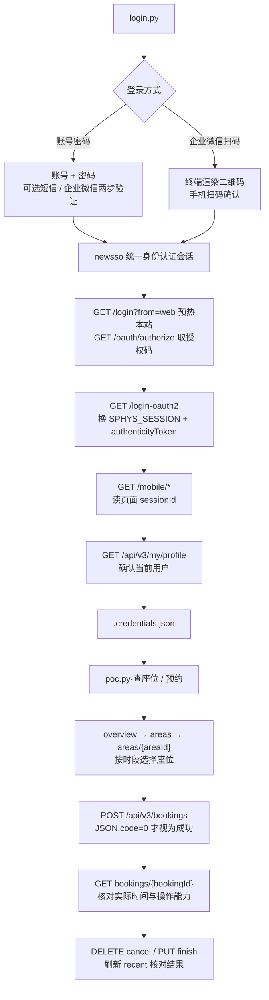

<div align="center">

# SHU Seat Booking POC

上海大学空间预约管理系统（`there.shu.edu.cn`）——登录一次，查询与预约四类座位

[](https://www.python.org/)
[](docs/api.md)
[](LICENSE)

</div>

---

## 流程解析



整体流程：**认证 → 换 there 会话 → 产出凭据 → 查询 / 预约**。
前三步在 `login.py` 中完成；随后 `poc.py` 使用凭据访问移动端 `/api/v3`。
凭据失效后重新登录即可，默认运行只显示账号与四类资源概览。

四个入口共用域名、业务路由与预约模型，通过 `x-room-type` 切换资源范围：

| 系统 | 移动页面 | 资源类型 |
| :--- | :--- | :--- |
| 校本部图书馆 | `/mobile/libseat` | `LIB_SEAT` |
| 24H 学习空间 | `/mobile/seat2021` | `STATION` |
| 延长智能中心 | `/mobile/seat-mgr` | `SEAT` |
| 科学与艺术中心 | `/mobile/csseat` | `CS_SEAT` |

| 文件 | 职责 |
| :--- | :--- |
| `login.py` | 认证 → 换本站会话 → 移动端 profile 校验 → 写出 `.credentials.json` |
| `poc.py` | 读凭据 → 账号 / 预约 / 区域 / 座位查询，显式执行创建、取消或结束 |
| `sso/` | 登录环节的薄适配层；统一身份认证实现在 git 子模块 [`vendor/shu-sso-poc/`](vendor/shu-sso-poc/) |
| `seat/` | 移动页面会话解析、业务 HTTP 客户端、预约请求组装与脱敏 |
| `tests/` | 离线单测与本地模拟登录 / 预约全链路 |
| `docs/` | 全部明确来源的结论、字段、样例、链路、OpenAPI 与证据 |

> 项目结构与文档风格参照 [shu-otp-poc](https://github.com/preca-hoshino/shu-otp-poc/tree/3108de766163a0b096221a4d2f8bb8ae075ee1cb)
> 和 [shu-ds-poc](https://github.com/preca-hoshino/shu-ds-poc/tree/72475557d5d8529b553f89f56f789636601f98ba)。
> SSO 子模块固定为 `941c7d5ea876c3b511f1bf9a8862b0cf91df9c3b`，认证实现保持一份，本站适配独立放在 `sso/`。

详细登录链、Cookie 与移动页面的衔接见 [`docs/login.md`](docs/login.md)。

---

## 快速开始

### 环境要求

| 项 | 要求 |
| :--- | :--- |
| Python | 3.10 或更高 |
| 依赖 | 见 `requirements.txt`（requests / cryptography / qrcode 等） |
| 网络 | 能访问 `newsso.shu.edu.cn`、`there.shu.edu.cn`；扫码还需访问企微服务 |
| 账号 | 本人可使用对应场馆的上海大学账号 |

### 安装

当前交付是本地项目目录。将 `shu-seat-booking-poc` 解压或复制到工作目录：

```bash
cd shu-seat-booking-poc

python -m venv .venv
.venv\Scripts\activate             # Windows
# source .venv/bin/activate         # Linux / macOS
pip install -r requirements.txt
```

项目使用真实 git 子模块。以后从 Git 仓库克隆时需带 `--recurse-submodules`；
已有 checkout 可执行 `git submodule update --init --recursive`。
本地交付目录中已包含固定版本的子模块源码。

### 使用

```bash
# ① 登录，生成凭据（账号密码或企微扫码）
python login.py                    # 交互式选登录方式
python login.py --login wecom_scan
python login.py --login password --method wecom

# ② 查询：默认只读账号与四类资源概览
python poc.py
python poc.py --room-type LIB_SEAT profile
python poc.py --room-type LIB_SEAT recent
python poc.py --room-type LIB_SEAT overview --day 2026-10-04
python poc.py --room-type LIB_SEAT areas --begin 2026-10-04 --end 2026-10-04

# ③ 查询选定区域在完整时段内的座位与规则
python poc.py --room-type LIB_SEAT rooms --area "<areaId>" \
    --begin "2026-10-04 09:00" --end "2026-10-04 10:00"

# ④ 先检查请求体；--dry-run 会查询与组装，但不创建预约
python poc.py --room-type LIB_SEAT book --area "<areaId>" --room "<roomId>" \
    --begin "2026-10-04 09:00" --end "2026-10-04 10:00" --dry-run

# 删除 --dry-run 才会向服务端提交创建请求
# 取消或提前结束均需使用成功创建返回的真实 bookingId
python poc.py --room-type LIB_SEAT detail "<bookingId>" --show-checks
python poc.py --room-type LIB_SEAT cancel "<bookingId>"
python poc.py --room-type STATION finish "<bookingId>"
```

上例多行使用 Bash 的 `\`；PowerShell 可写成一行。日期应按实际预约日调整，
`areaId` / `roomId` 从当前查询结果选择，`bookingId` 从成功创建响应取得。
文档中的 `BOOKING_LIB` 等是脱敏别名，无法用于真实调用。

使用 `--json` 查看脱敏返回 JSON，`--capture` 将脱敏诊断保存到 `captures/`。
公共参数可放在子命令前或后，细节见 [`docs/cli.md`](docs/cli.md)。

### 自测

```bash
python tests/test_offline.py        # 捕获契约、解析、请求组装、脱敏等离线测试
python tests/test_e2e_mock.py       # 模拟四类预约、详情与取消 / 结束
python tests/test_auth_mock.py      # 模拟密码 / 2FA / 扫码、OAuth 与 CLI
# 或一次运行全部 34 项测试
python -m unittest discover -s tests -v
python login.py --check            # 在线读取移动 profile，验证已有凭据
```

离线测试与真实服务验证分别记录。本次开发环境无法访问目标域名，
项目实现基于已有 HAR 与固定项目源码，尚未实测真实账号登录或预约。

---

## 文档

各专题文档在 [`docs/`](docs/) 下，README 只保留概览、快速开始与已知约束：

| 文档 | 内容 |
| :--- | :--- |
| [`docs/login.md`](docs/login.md) | newsso 密码 / 二步 / 扫码、OAuth、Cookie 与移动会话衔接 |
| [`docs/api.md`](docs/api.md) | 四系统九个实测业务端点，全部捕获参数 / 返回字段 / 样例，源码引用与未知方法记录 |
| [`docs/booking.md`](docs/booking.md) | 一次完整预约的客户端设计、四条真实链路、八次创建尝试 |
| [`docs/cli.md`](docs/cli.md) | `login.py` / `poc.py` 参数与命令用法 |
| [`docs/testing.md`](docs/testing.md) | 离线与本地模拟测试、凭据检查、真实环境验证步骤 |
| [`docs/evidence.md`](docs/evidence.md) | 来源提交、HAR 哈希、九十条业务时间线与适用边界 |
| [`docs/research.md`](docs/research.md) | 本对话全部明确来源结论的完整研究记录 |
| [`docs/openapi/there.openapi.yaml`](docs/openapi/there.openapi.yaml) | OpenAPI 3.1.1；仅明确方法操作，未知方法留在 URL 元数据 |
| [`docs/data/`](docs/data/) | 脱敏接口目录、517 个资源快照、登录证据与 CSV 时间线 |

---

## 已知约束

| 约束 | 说明 |
| :--- | :--- |
| 登录与预约来源分开 | HAR 从已登录状态开始；登录来自固定版 `shu-sso-poc`，两段按本站 Cookie 与移动 HTML 衔接，没有完整连续登录 HAR |
| 凭据会失效 | Cookie 与页面 sessionId 都来自当前会话；用 `python login.py --check` 检查，失效后重新登录 |
| HTTP 200 不等于成功 | 九十次业务请求 HTTP 全为 200，四次创建仍被 JSON.code=200 拒绝；只有 code=0 才继续取预约 ID |
| 日期与时长由服务端决定 | 日期数组、可选座位与 `bookingLimitDays` 不足以证明创建准入；24H 样本还发生开始时间调整 |
| 单用户提交频率限制 | 两个场馆实测提示“同一用户10秒只能提交一次”；创建超时或拒绝后先查询 recent，避免直接重复创建 |
| 状态不单独决定操作 | 根据详情 `abilities` 判断操作；24H finish 后也返回 CANCEL，保留实际时间与 origEndAt |
| 签到仅有源码证据 | `POST checkInUse` 只见图书馆脚本，未捕获实际请求 / 响应；`check-in --experimental` 是显式实验入口 |
| 快照不是实时占用 | 517 个资源来自四个选中区域，快照在创建后、取消 / 结束前；使用时必须重新查询 |
| 未知方法保留未知 | v2 三个路径、二维码与签到页 URL 没有方法契约；不向其自动发请求，也没有加入编辑 / 评论等推测路由 |
| 仅限个人学习研究 | 请遵守学校的信息系统使用规定与服务条款 |

## License

AGPL-3.0
