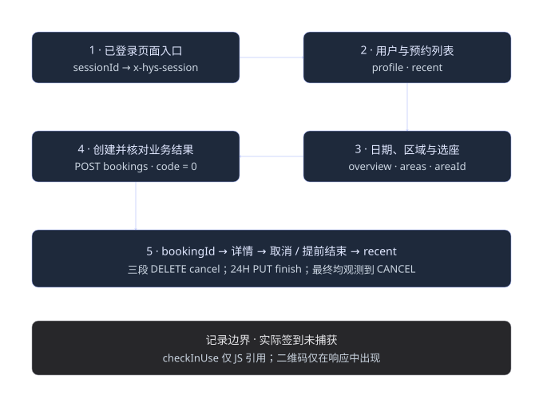

# 预约链路与四场馆实测

> 返回 [项目 README](../README.md) · [文档索引](README.md)

资料依据 2026-10-03 的四个用户 HAR 与固定提交的 `shu-sso-poc`。以下保留完整捕获字段、脱敏样例与来源边界；章节编号沿用[完整研究记录](research.md)，方便交叉引用。接口章节见 [api.md](api.md)，认证章节见 [login.md](login.md)，预约设计与四条实测链见 [booking.md](booking.md)，来源及九十条时间线见 [evidence.md](evidence.md)。

## 6 一次完整预约链路的客户端设计

### 6.1 状态与数据依赖

登录阶段按第 3 节完成 newsso 认证与 there 回调，再进入移动页面取得 sessionId。业务阶段遵循已捕获的依赖顺序；overview 和区域列表可相邻或并发，没有观测到强制串行依赖。

| 步骤 | 动作 | 输出与下一步依赖 | 判定 |
| --- | --- | --- | --- |
| 1 | 选择系统与入口，完成 SSO/本站会话 | 当前 Cookie jar、移动 HTML.sessionId、roomType | SSO 与本站 Cookie 分域；以当前页面为头来源。 |
| 2 | GET my/profile，再 GET my/bookings/recent | profile.id、profile.name、已有预约 | code=0；用户非匿名；已有列表按 status、时间、abilities 读取。 |
| 3 | overview?day=D 与 areas?begin=D&end=D | 候选日期与区域树 | 不能把 overview 配置覆盖实际区域配置。 |
| 4 | GET areas/{areaId}?begin=完整开始时间&end=完整结束时间 | 当前区间 rooms[]、bookingTimes、资源状态 | 取实际区域配置；选未禁用、可预约的座位。 |
| 5 | POST bookings，rooms/times/subject/meetingMembers | 成功时 data[0].id | HTTP 成功并 JSON.code=0 才进入成功分支。 |
| 6 | 刷新 recent、区域详情、overview；GET bookings/{bookingId} | 服务端最终开始/结束时间、状态、abilities | 服务端可能调整请求开始时间；刷新动作本身不表示创建成功。 |
| 7 | 按详情能力选择 cancel 或 finish | 操作响应与最终记录 | 只执行用户所选择的动作；finish 对应 close 能力的实测样本。 |
| 8 | GET recent 核对刚才 bookingId | 最终状态、时间、duration、origEndAt | 不能固定假设 finish 最终为 FINISHED。 |

参数来源链为 `areaId ← 区域列表.data[].id`、`rooms[] ← 区域详情.data.rooms[]`、`subject ← profile.data.name`、`meetingMembers ← [profile.data.id]`、`bookingId ← 成功创建.data[0].id`。四系统八次创建的个人字段映射已逐条一致；roomId 与 bookingId 不可互换。



### 6.2 图书馆实例的完整业务序列

以下固定采用捕获成功样本的日期和座位，仅用于解释接口衔接。运行时应重新查询当前规则、资源与可用日期，不能把 2026-10-03 的快照当作实时状态。

```http
GET /mobile/libseat
  → 保存 HTML.sessionId 及当前本站 Cookie
GET /api/v3/my/profile
GET /api/v3/my/bookings/recent
GET /api/v3/booking-status/overview?day=2026-10-03
GET /api/v3/booking-status/areas?begin=2026-10-03&end=2026-10-03
GET /api/v3/booking-status/areas/KRdcGiyK99gzrqCepi91Cv?begin=2026-10-03%2008%3A30&end=2026-10-03%2009%3A30
POST /api/v3/bookings
  → JSON.code=0 后取 data[0].id
GET /api/v3/my/bookings/recent
GET /api/v3/bookings/BOOKING_LIB?showChecks=true
  → 实际返回 cancel / waitOpen 能力
DELETE /api/v3/bookings/BOOKING_LIB/cancel
GET /api/v3/my/bookings/recent
  → BOOKING_LIB 最终 status=CANCEL
```

创建体如下，使用刚查询到的完整座位对象；占位符由当前 profile 填入。

```json
{
  "rooms": [
    {
      "id": "2RLARqe9egAFzej4ALBizj",
      "name": "2E015",
      "officeAreaId": "KRdcGiyK99gzrqCepi91Cv",
      "disabled": false,
      "showOrder": 15,
      "isBusy": false,
      "isBooked": false,
      "abilities": [
        "booking"
      ]
    }
  ],
  "times": [
    {
      "startDate": "2026-10-03",
      "startTime": "08:30",
      "endDate": "2026-10-03",
      "endTime": "09:30"
    }
  ],
  "subject": "<profile.data.name>",
  "meetingMembers": [
    "<profile.data.id>"
  ]
}
```

### 6.3 通用实现伪代码

下面是业务组织伪代码，不是已执行的客户端，也不增加新端点。api 函数负责附公共参数、标准 URL 编码和 Cookie；参数类型以第 4 节为准。

```python
ctx = login_newsso_and_redeem_there()       # 第 3 节，密码/二步或企微分支
page = open_selected_mobile_page(ctx)
ctx.session = page.sessionId
ctx.room_type = selected_system.room_type

profile = api("GET", "/api/v3/my/profile").data
assert profile.isAnonymous is False
recent = api("GET", "/api/v3/my/bookings/recent").data
overview = api("GET", "/api/v3/booking-status/overview", query={"day": day}).data
areas = api("GET", "/api/v3/booking-status/areas", query={"begin": day, "end": day}).data

area = api("GET", f"/api/v3/booking-status/areas/{selected_area_id}",
           query={"begin": begin_datetime, "end": end_datetime}).data
room = select_room_from(area.rooms)         # 当前查询对象，检查禁用与 booking 能力
payload = {"rooms": [room], "times": [{"startDate": start_date,
           "startTime": start_time, "endDate": end_date, "endTime": end_time}],
           "subject": profile.name, "meetingMembers": [profile.id]}

result = api("POST", "/api/v3/bookings", json=payload, check_business=False)
if result.code != 0:
    refresh_recent_and_show_server_message(result)
    stop_without_booking_id()
booking_id = result.data[0].id
refresh_recent_area_and_overview()
detail = api("GET", f"/api/v3/bookings/{booking_id}", query=detail_query_for_system()).data
show_actual_times_status_and_abilities(detail)

if user_action == "cancel" and "cancel" in detail.abilities:
    api("DELETE", f"/api/v3/bookings/{booking_id}/cancel")
elif user_action == "finish" and "close" in detail.abilities:
    api("PUT", f"/api/v3/bookings/{booking_id}/finish")
recent = api("GET", "/api/v3/my/bookings/recent").data
verify_this_booking_in(recent, booking_id)
```

### 6.4 失败与结果核对

创建业务失败保持 HTTP 200，JSON.code=200，可能仅有 warnMessage。样本中有两天限制、八小时限制和同用户十秒一次限制；拒绝后紧接重试也会触发频率错误。客户端设计应锁定并发提交、按服务端提示节流，避免无间隔自动重试。捕获数据未验证精确十秒边界、频率重置策略或幂等键。

网络超时或响应丢失时，创建结果可能未知；这时先查询 recent 核对时间、资源和状态，再决定是否重新提交。此为避免重复预约的客户端处理设计，服务端幂等能力未验证。日期与时长最终以服务端创建/详情为准；24H 样本已发生开始时间调整。

JS 公共客户端包含 401、403、404、502 错误分支：401 导航 /login，403 无权限，404 资源不存在，502 服务端问题。没有这些 HTTP 响应的 HAR 样本，返回正文未知。

实际签到不属于本次成功闭环验证范围。needCheckin=true 和 checkinStatus=N 不能证明已签到；OPEN 也不能证明已签到。只知道第 7 节的调用/URL 线索，不给出未捕获签到条件或签到成功返回体。

## 8 四段实测预约链与全部创建尝试

下表全部为北京时间，括号中的 `#N` 是相应 HAR 的原始序号。创建阶段保留了失败和重试，后台资源及监控请求不混入业务步骤。

### 8.1 校本部图书馆

入口 `/mobile/libseat`，实际资源类型 `LIB_SEAT`。

| 时间 | 证据 | 行为 / 结果 | 请求 |
| --- | --- | --- | --- |
| 00:25:30.416 | #69 | 进入图书馆页面 | GET `/mobile/libseat` |
| 00:25:31.686 | #68 | 取当前用户 | GET `/api/v3/my/profile` |
| 00:25:31.897 | #66 | 取最近预约：空 | GET `/api/v3/my/bookings/recent` |
| 00:25:45.902 | #57 | 取区域列表 | GET `/api/v3/booking-status/areas` |
| 00:25:45.940 | #67 | 取日期概览 | GET `/api/v3/booking-status/overview` |
| 00:25:54.358 | #47 | 选择二楼东侧，日期 10-05 | GET `/api/v3/booking-status/areas/KRdcGiyK99gzrqCepi91Cv` |
| 00:26:01.216 | #40 | 查询 10-05 09:00—12:00 | GET `/api/v3/booking-status/areas/KRdcGiyK99gzrqCepi91Cv` |
| 00:26:04.232 | #39 | 提交 2E009：日期限制拒绝 | POST `/api/v3/bookings` |
| 00:26:13.569 | #34 | 9.337 秒后再次提交：10 秒限制拒绝 | POST `/api/v3/bookings` |
| 00:26:24.391 | #26 | 切换到 10-03 | GET `/api/v3/booking-status/areas/KRdcGiyK99gzrqCepi91Cv` |
| 00:26:28.739 | #21 | 查询 08:30—09:30 | GET `/api/v3/booking-status/areas/KRdcGiyK99gzrqCepi91Cv` |
| 00:26:31.483 | #20 | 提交 2E015：成功 BOOKING_LIB | POST `/api/v3/bookings` |
| 00:26:32.778 | #17 | 最近预约出现 OPEN | GET `/api/v3/my/bookings/recent` |
| 00:26:33.553 | #12 | 预约详情：cancel / waitOpen 能力 | GET `/api/v3/bookings/BOOKING_LIB` |
| 00:26:46.228 | #5 | 取消：成功 | DELETE `/api/v3/bookings/BOOKING_LIB/cancel` |
| 00:26:47.377 | #4 | 刷新最近预约：CANCEL | GET `/api/v3/my/bookings/recent` |

图书馆两次失败不会生成预约 ID。最终成功的是 10-03 08:30—09:30 的 2E015，而不是 10-05 的 2E009。首次失败与第二次失败之间为 9.337 秒，与“同一用户10秒只能提交一次”一致。

### 8.2 24H学习空间

入口 `/mobile/seat2021`，实际资源类型 `STATION`。

| 时间 | 证据 | 行为 / 结果 | 请求 |
| --- | --- | --- | --- |
| 00:32:07.160 | #39 | 进入 24H 页面 | GET `/mobile/seat2021` |
| 00:32:08.477 | #36 | 取当前用户 | GET `/api/v3/my/profile` |
| 00:32:08.743 | #35 | 取最近预约：空 | GET `/api/v3/my/bookings/recent` |
| 00:32:12.413 | #27 | 取日期概览 | GET `/api/v3/booking-status/overview` |
| 00:32:12.449 | #38 | 取区域列表 | GET `/api/v3/booking-status/areas` |
| 00:32:16.290 | #21 | 选择 B 区 | GET `/api/v3/booking-status/areas/DsNjTXf8icSMh3SXB5HPge` |
| 00:32:21.363 | #15 | 查询 00:30—01:30 | GET `/api/v3/booking-status/areas/DsNjTXf8icSMh3SXB5HPge` |
| 00:32:24.484 | #14 | 提交 B-034：成功 BOOKING_STATION | POST `/api/v3/bookings` |
| 00:32:25.751 | #13 | 最近预约出现 OPEN | GET `/api/v3/my/bookings/recent` |
| 00:32:26.305 | #9 | 详情：实际开始时间 00:33，有 close 能力 | GET `/api/v3/bookings/BOOKING_STATION` |
| 00:32:35.607 | #2 | 提前结束：成功 | PUT `/api/v3/bookings/BOOKING_STATION/finish` |
| 00:32:36.707 | #1 | 刷新最近预约：CANCEL，时长 0 | GET `/api/v3/my/bookings/recent` |

请求体是 00:30—01:30，但创建时已在 00:32 左右，服务器返回的开始时间是 00:33，时长 57 分钟。只能确认发生了开始时间调整，不能凭一个样本断言其取整算法。提前结束后 beginTime=endTime=00:33、duration=0、origEndAt=01:30，且最终状态是 CANCEL；因此不能预设 finish 一定返回 FINISHED 状态。

### 8.3 延长智能中心

入口 `/mobile/seat-mgr`，实际资源类型 `SEAT`。

| 时间 | 证据 | 行为 / 结果 | 请求 |
| --- | --- | --- | --- |
| 00:33:41.760 | #67 | 进入延长入口 | GET `/mobile/seat-mgr` |
| 00:33:48.303 | #63 | 取当前用户 | GET `/api/v3/my/profile` |
| 00:33:48.998 | #64 | 取最近预约：空 | GET `/api/v3/my/bookings/recent` |
| 00:33:52.175 | #52 | 取区域列表 | GET `/api/v3/booking-status/areas` |
| 00:33:52.175 | #53 | 取日期概览 | GET `/api/v3/booking-status/overview` |
| 00:33:54.466 | #45 | 切换到 10-04 | GET `/api/v3/booking-status/areas` |
| 00:33:55.324 | #42 | 切换到 10-05 | GET `/api/v3/booking-status/areas` |
| 00:33:58.794 | #32 | 回到 10-03，选择 B 区 | GET `/api/v3/booking-status/areas/KbuCBLACKv74KmiBqE51z6` |
| 00:34:00.964 | #27 | 查询 09:30—10:30 | GET `/api/v3/booking-status/areas/KbuCBLACKv74KmiBqE51z6` |
| 00:34:06.351 | #26 | 提交 11-3：成功 BOOKING_SEAT | POST `/api/v3/bookings` |
| 00:34:07.746 | #25 | 最近预约出现 OPEN | GET `/api/v3/my/bookings/recent` |
| 00:34:08.202 | #18 | 预约详情：cancel / waitOpen 能力 | GET `/api/v3/bookings/BOOKING_SEAT` |
| 00:34:25.456 | #3 | 取消：成功 | DELETE `/api/v3/bookings/BOOKING_SEAT/cancel` |
| 00:34:26.686 | #2 | 刷新最近预约：CANCEL | GET `/api/v3/my/bookings/recent` |

业务响应中的完整区域名称是“智能信息中心智慧共享空间-B”。成功时段为 10-03 09:30—10:30，座位 11-3，随后取消。切换日期后的部分查询属于浏览过程，没有生成对应日期的预约。

### 8.4 科学与艺术中心

入口 `/mobile/csseat`，实际资源类型 `CS_SEAT`。

| 时间 | 证据 | 行为 / 结果 | 请求 |
| --- | --- | --- | --- |
| 00:35:05.694 | #64 | 进入科艺入口 | GET `/mobile/csseat` |
| 00:35:07.011 | #62 | 取当前用户 | GET `/api/v3/my/profile` |
| 00:35:07.230 | #60 | 取最近预约：空 | GET `/api/v3/my/bookings/recent` |
| 00:35:10.300 | #51 | 取日期概览 | GET `/api/v3/booking-status/overview` |
| 00:35:10.336 | #61 | 取区域列表 | GET `/api/v3/booking-status/areas` |
| 00:35:14.202 | #38 | 选择学生共享创作中心A | GET `/api/v3/booking-status/areas/VQyeEokNwJnq7h8sVwmnfg` |
| 00:35:20.934 | #34 | 提交 A-10：9 小时超限 | POST `/api/v3/bookings` |
| 00:35:22.088 | #31 | 查询 09:00—18:00 | GET `/api/v3/booking-status/areas/VQyeEokNwJnq7h8sVwmnfg` |
| 00:35:27.759 | #29 | 改为 09:00—14:00 | GET `/api/v3/booking-status/areas/VQyeEokNwJnq7h8sVwmnfg` |
| 00:35:29.615 | #28 | 8.681 秒后提交 A-21：10 秒限制拒绝 | POST `/api/v3/bookings` |
| 00:35:44.954 | #25 | 15.339 秒后提交 A-27：成功 BOOKING_CS | POST `/api/v3/bookings` |
| 00:35:46.254 | #24 | 最近预约出现 OPEN | GET `/api/v3/my/bookings/recent` |
| 00:35:47.695 | #17 | 预约详情：cancel / waitOpen 能力 | GET `/api/v3/bookings/BOOKING_CS` |
| 00:35:57.264 | #3 | 取消：成功 | DELETE `/api/v3/bookings/BOOKING_CS/cancel` |
| 00:35:58.331 | #2 | 刷新最近预约：CANCEL | GET `/api/v3/my/bookings/recent` |

最初选择的 09:00—18:00 为 9 小时，即使区域查询显示座位可选，创建仍因超过 8 小时被拒绝。8.681 秒后的 5 小时请求又触发频率限制；最后换 A-27 成功。拒绝的请求也处于后续提交频率判断之内，与本次样本一致。

### 8.5 全部八次创建尝试

| 场馆 | 证据 | 提交时间 | 座位 | 申请时段 | code | 结果 |
| --- | --- | --- | --- | --- | --- | --- |
| 校本部图书馆 | #39 | 00:26:04.232 | 2E009 | 2026-10-05 09:00—12:00 | 200 | 不能预订超过2天的预订 |
| 校本部图书馆 | #34 | 00:26:13.569 | 2E009 | 2026-10-05 09:00—12:00 | 200 | 同一用户10秒只能提交一次 |
| 校本部图书馆 | #20 | 00:26:31.483 | 2E015 | 2026-10-03 08:30—09:30 | 0 | 创建预订成功 |
| 24H学习空间 | #14 | 00:32:24.484 | B-034 | 2026-10-03 00:30—01:30 | 0 | 创建预订成功 |
| 延长智能中心 | #26 | 00:34:06.351 | 11-3 | 2026-10-03 09:30—10:30 | 0 | 创建预订成功 |
| 科学与艺术中心 | #34 | 00:35:20.934 | A-10 | 2026-10-03 09:00—18:00 | 200 | 不能预订超过8小时的meetingtype.cs_seat |
| 科学与艺术中心 | #28 | 00:35:29.615 | A-21 | 2026-10-03 09:00—14:00 | 200 | 同一用户10秒只能提交一次 |
| 科学与艺术中心 | #25 | 00:35:44.954 | A-27 | 2026-10-03 09:00—14:00 | 0 | 创建meetingType.CS_SEAT成功 |

对客户端流程的实际影响：需要单用户提交节流，不能失败后立刻连续提交；出错后核对最近预约，避免把不确定的创建结果当作无订单；最终日期和时长验证以服务端响应为准。本样本只证实 10 秒频率限制的错误提示，未探测精确边界、重置机制或幂等实现。

### 8.6 24H HAR 中的超星支线

24H 文件还记录 selfreport.shu.edu.cn → cxxz.shu.edu.cn → cv-p.chaoxing.com → office.chaoxing.com 的另一座位系统入口。它不是 there 登录链；本次没有那条支线的预约创建，不能合并其 roomId、fidEnc 或接口到 there schema。

| 顺序 | 原始证据 | 主机与路由 | 状态 |
| --- | --- | --- | --- |
| 1 | 24H学习空间预约.har#104 | selfreport.shu.edu.cn/QYWXRedirect.ashx | 302 |
| 2 | #103 | cxxz.shu.edu.cn/auth-shu/auth | 302 |
| 3 | #102 | cv-p.chaoxing.com/auth-shu/authJump | 302 |
| 4 | #101 | office.chaoxing.com/front/apps/seat/index | 302 |
| 5 | #100 | office.chaoxing.com/front/third/apps/seat/index | 200 |
