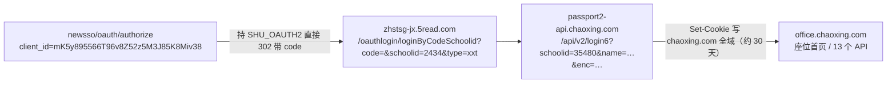

# 超星（学习通）图书馆座位系统

> 返回 [项目 README](../README.md) · [文档索引](README.md)

上海大学图书馆的**超星座位预约系统**（2021-01-01 起运行），覆盖钱伟长图书馆、
嘉定联合馆与延长文荟馆的座位。与 there 四入口是两家供应商的并行系统：入口、
登录链、域名与端点完全不同，仅共享统一身份认证（`newsso.shu.edu.cn`）。

来源：2026-10-05 两份 HAR（业务链 / 登录链）+ 浏览器实测（含签名动态分析与
服务端 A/B 对照）+ Python 客户端对真实服务器的只读与必败提交验证。
本文只列已实测内容；未验证项在最后一节明确标注。

## 1 系统定位与入口

| 项 | 值 |
| :--- | :--- |
| 业务站点 | `office.chaoxing.com` |
| 机构号 | `fid / deptId = 35480`（"上海大学图书馆"），`deptIdEnc = fidEnc = 00bae7f2bdea485a` |
| 房间 | 10 个、1543 座：钱伟长馆（四/五楼内外圈）、嘉定联合馆（一楼报刊/图书阅览、一楼自修、二楼自修、三楼阅览）、延长文荟馆（期刊阅览室） |
| 官方入口 | 企业微信工作台应用（agentid 1000049）/ 学习通 App 邀请码 `shdxtsg` |
| 规则要点 | 每天 07:00 开放**当天**预约；服务时段 08:00–22:00；时段粒度 30 分钟；最短 1 小时；同时在约 2 个；签到窗口 ±20 分钟；暂离 30 分钟（餐时 60）；每周违约 3 次暂停 |

实测称同日只能预约当天：次日与 5 天后的 select 页直接报
“当前区域未到开放预约时间”（`/front/apps/reserve/error/code/500?msg=…`）。

## 2 登录链：与 fysso 链是两条平行桥

座位系统的机构 35480 与全校学习通机构 209 各自绑定一条不同的换会话链：

| 机构 | CAS 桥 | 产物 |
| :--- | :--- | :--- |
| 209（全校学习通） | `shu.fysso.chaoxing.com/sso/shu` | learning.shu.edu.cn 会话（泛雅） |
| **35480（图书馆座位）** | `zhstsg-jx.5read.com` | **chaoxing.com 全域会话，直达座位系统** |

本 POC 实现的是 35480 一条（换会话已外置到 vendor 子模块 `systems/chaoxing.com/`，
由 `sso/runner.py` 的 `chaoxing_redeem` 接入；座位侧只消费会话），全链逐步实测：



要点：

- **无头重放已验证**：用户只扫码完成一次 SSO，之后 Python 仅凭 `SHU_OAUTH2`
  重走 `newsso/oauth/authorize` 即自动出新 code，全链零人工交互（浏览器实测）；
- `login6` 的 `enc` 两次登录完全相同，随 302 跟随即可，无需自行计算；
- 授权请求 `scope` / `state` 传空串（契约原样），回调为 http 的
  `http://shu.fysso.chaoxing.com/sso/shu`（**不是本链**，本链回调在 5read）；
- 普通桌面 Chrome UA 全程可用；安卓企微 UA、`X-Requested-With: com.tencent.wework`
  实测均无差异 —— 自动化不需要伪装成企微客户端。

## 3 端点（13 个实测 API + 关键页面）

基地址 `https://office.chaoxing.com`。

| 方法 | 路径 | 参数 | 说明 |
| :--- | :--- | :--- | :--- |
| GET | `/data/apps/seat/index` | `fidEnc`, `r` | 首页：seatConfig / curReserves / nearReserves / officeDomain |
| GET | `/data/apps/seat/config` | `fidEnc` | 规则配置（暂离、违约、签到、续约等） |
| GET | `/data/apps/seat/levels` | `deptIdEnc`, `type=0` | 层级字典（自修/阅览） |
| GET | `/data/apps/seat/room/list` | `time,cpage,pageSize,day,deptIdEnc` | 房间列表（含 capacity / startSeatNum） |
| GET | `/data/apps/seat/room/reserve-window/check` | `roomId,day,deptIdEnc,fidEnc` | 开放窗口（`AVAILABLE` + 07:00 时间戳） |
| POST | `/data/apps/seat/room/info` | `id,toDay,fidEnc,queryReserve` | 房间详情 + 已占座位区间 |
| POST | `/data/apps/seat/getusedseatnums` | `roomId,startTime,endTime,day,fidEnc` | 时段内已占座位 |
| GET | `/data/apps/seat/check/exist` | `seatNum,roomId` | 座位存在/占用检查 |
| POST | `/data/apps/seat/submit` | 8 字段 + `enc`（见下节） | 创建预约 |
| GET | `/data/apps/seat/cancel` | `id` | 取消（GET，无二次确认） |
| GET | `/data/apps/seat/curusedshow` | `fidEnc` | 当前使用展示 |
| GET | `/data/apps/seat/person/role` | `fidEnc` | 角色信息 |
| GET | `/data/apps/seat/entrance/config` | `appType,fidEnc` | 入口配置（含 defaultReserve 等） |

页面：座位首页 `/front/third/apps/seat/index?fidEnc=…`（HTML 内嵌
`userLoginInfo` 作为登录判据）；选座页 `/front/third/apps/seat/select?deptIdEnc=&id=&day=&backLevel=2&fidEnc=`
（HTML 内嵌签名盐）。

信封：`{"success": true, "data": …}`；业务失败 `success=false` + `msg`
（如“该时间段已过，不可预约！”“同一用户10秒只能提交一次”）。HTTP 均为 200。

## 4 提交签名（enc）与盐

提交体 8 个字段（键名字母序拼 `[k=v]`，末尾拼盐，整体 MD5）：

```text
enc = md5(
  "[captcha=][day=2026-10-05][deptIdEnc=00bae7f2bdea485a][endTime=22:00]"
  "[roomId=6508][seatNum=135][startTime=21:00][wyToken=]"
  "[31f510e3790a43959f20531c9987e029_404270468]"
)
```

- 盐来自 select 页 `<input type="hidden" id="submit_enc" value="<32hex>_<uid>"/>`，
  **每次载入页面服务端重新下发**；因此每次提交前重新拉取 select 页；
- 8 个字段固定全含，`captcha` / `wyToken` 为空也必须保留；
- 算法通过浏览器动态分析复现（requirejs 加载 `submitVerify` 后 hook `hex_md5`
  捕获明文），并以服务端 A/B 对照确认：
  - 正确签名 → 进入业务校验（“该时间段已过，不可预约！”）；
  - 改一位的错误签名 → “本次操作安全验证已超时(代码:303)”。
- 实现与真实向量：`seat/chaoxing/enc.py`、`tests/test_chaoxing_offline.py`。

## 5 凭据与自动化流程

| 项 | 说明 |
| :--- | :--- |
| 凭据文件 | `.credentials.chaoxing.json`（仅 chaoxing.com 域 Cookie；0600 原子写） |
| 会话寿命 | `p_auth_token` 为 HS256 JWT，约 30 天；失效后重新 `login.py --system chaoxing` |
| 登录 | `login.py` 默认 `--system both`：一次认证同时换 there 与超星会话，各自验证、独立落盘；任一失败不会写出该系统的伪成功凭据 |
| 提交节流 | 本进程 10 秒（与服务端“同一用户10秒只能提交一次”对齐）；业务拒绝与网络失败同样计入 |
| 不自动重试 | 提交超时/失败后先查 recent 核对，不盲目重发（与 there 侧同一策略） |
| 可用性为派生值 | `available` = 容量区间 − 服务端已占；未逐座位探测，创建时仍以服务端校验为准 |

## 6 CLI

```bash
python login.py --system chaoxing                 # 只登录超星（或 both / there）
python poc.py --system chaoxing                   # 只读概览：用户 + 当前/最近预约
python poc.py --system chaoxing config            # 规则摘要
python poc.py --system chaoxing rooms --day 2026-10-05
python poc.py --system chaoxing available --room 6508 --day 2026-10-05 --begin 21:00 --end 22:00
python poc.py --system chaoxing book --room 6508 --day 2026-10-05 \
    --begin 21:00 --end 22:00 --seat 135 --dry-run   # 拉真盐并签名，不提交
python poc.py --system chaoxing cancel 194166871
```

`--json` / `--capture` 行为与 there 侧一致；终端输出对 `uid` / `sno` 脱敏。

## 7 实测与验证记录（2026-10-05）

| 实验 | 结果 |
| :--- | :--- |
| 浏览器换会话重放 | newsso authorize 302 出 code → 5read → login6 → 落地 chaoxing 域；零人工交互 |
| 直连座位系统 | 免登进入，读取真实用户与预约记录 |
| UA/请求头伪装对照 | 桌面 UA / 安卓企微 UA / 带或不带企微 `X-Requested-With` 全通 |
| 签名 A/B 对照 | 正确签名进业务层；错一位签名报 303 |
| Python 端到端（真实服务器） | 概览 / rooms / available / config 实跑通过；`book --dry-run` 拉到真盐并签名；必败提交被业务层拒绝（零副作用，无新预约） |
| 离线测试 | `tests/test_chaoxing_offline.py` 23 项：真实签名向量、提交 / 节流 / 取消、凭据校验与换会话链 |

## 8 未证实与边界

| 项 | 状态 |
| :--- | :--- |
| 真实成功创建 + 取消闭环 | 本 POC 未提交任何真实预约；签名已被服务端接受（必败样本），创建成功路径以服务端返回为准 |
| 盐的一次性语义 | 过期与签名错误同报 303，无法区分；策略为每次重取值 |
| 座位状态枚举 | 仅实录 `0`（进行中）与 `7`（已结束），其余原样显示数字 |
| fysso 链（209，学习通网页版） | 未实现；与座位无关，留作后续如需学习通自动化时扩展 |
| `captcha` / 易盾风控 | 未触发；如触发需另行处理（页面加载网易易盾与超星验证码组件） |
| `office-static…/seat/main.js` 以外的前端细节 | 未逐文件还原：仅还原签名模块的输入契约与算法 |

## 9 来源

- HAR：`图书馆分馆座位预约.har`（业务链，204 条）、`补充.har`（newsso→学习通登录链，132 条）
- 浏览器实验：devtools 会话（换会话重放、直连验证、UA 对照、签名 hook、必败提交 A/B）
- 端点与规则字段主体来自 HAR 与页面 HTML；`seat/chaoxing/config.py` 只收录实测值
