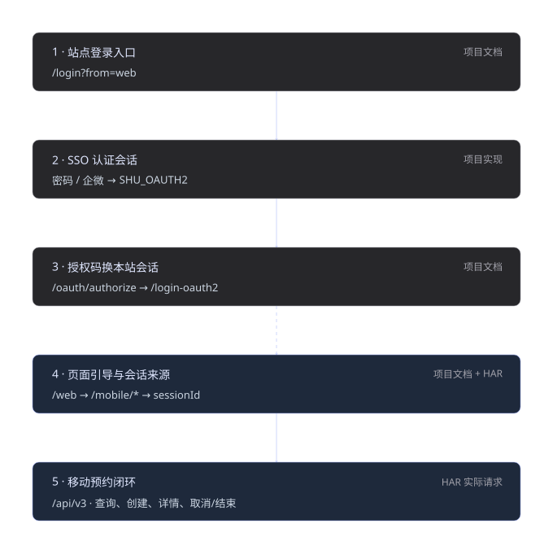

# 登录与凭据

> 返回 [项目 README](../README.md) · [文档索引](README.md)

资料依据 2026-10-03 的四个用户 HAR 与固定提交的 `shu-sso-poc`。以下保留完整捕获字段、脱敏样例与来源边界；章节编号沿用[完整研究记录](research.md)，方便交叉引用。接口章节见 [api.md](api.md)，认证章节见 [login.md](login.md)，预约设计与四条实测链见 [booking.md](booking.md)，来源及九十条时间线见 [evidence.md](evidence.md)。

`login.py` 负责 **认证 → 换 there 会话 → 验证移动 profile → 保存凭据**。
SSO 密码、二步和扫码协议复用固定版本的 git 子模块；`sso/` 只做 there 配置、
结果校验与脱敏适配，`seat/` 负责移动页面引导与 `/api/v3` 请求。

## 本项目的凭据

`.credentials.json` 供 `poc.py` 复用，仅在移动页面解析与 profile 检查都通过后保存。
检查至少包括业务 `code=0`、非空 id/name 和非匿名用户；回调 HTTP 200、
站点 URL 或仅 Cookie 存在都不足以触发成功落盘。

凭据保留 there 域 Cookie 的域、路径、安全标记、有效期和其余 CookieJar 属性，
恢复时不会将已过期 Cookie 改成无有效期 Cookie。
`SHU_OAUTH2` 留在认证过程的内存会话中，不导出成 there 业务 Cookie。
移动 HTML/sessionId 不固定写入凭据：业务客户端重新打开对应入口获取当前值。

以下是**本项目的文件结构样例**，不是服务端返回体；所有私有值均为占位符：

```json
{
  "version": 1,
  "created_at": "2026-10-03T00:00:00+08:00",
  "username": "<本人账号>",
  "display_name": "<姓名>",
  "room_type": "LIB_SEAT",
  "there": {
    "base": "https://there.shu.edu.cn",
    "room_type": "LIB_SEAT",
    "mobile_path": "/mobile/libseat"
  },
  "profile": {
    "id": "<profile.data.id>",
    "name": "<profile.data.name>"
  },
  "cookies": [
    {
      "version": 0,
      "name": "SPHYS_SESSION",
      "value": "<本站 Cookie>",
      "domain": "there.shu.edu.cn",
      "domain_specified": false,
      "domain_initial_dot": false,
      "path": "/",
      "path_specified": true,
      "secure": true,
      "expires": null,
      "discard": true,
      "port": null,
      "port_specified": false,
      "comment": null,
      "comment_url": null,
      "rfc2109": false,
      "rest": {"HttpOnly": null}
    }
  ]
}
```

Cookie 数量、属性与有效期以当次服务的 Set-Cookie 为准，样例仅展示一种记录。
文件使用临时文件原子替换，尝试设置 `0600`；Windows 上该权限位不等同于 ACL。
密码、二步验证码、SSO 会话、完整 profile 与追踪正文不进入凭据文件。

手动 `--cookie` / `SHU_SEAT_COOKIE` 是本站 Cookie 的兜底路径，会跳过 SSO，
但继续读移动 HTML 和 profile。只接受 there Cookie；不把手动 SHU_OAUTH2 发往本站。
`python login.py --check` 读取已有凭据做同一移动 profile 检查，不重新执行登录。
凭据读取路径为显式参数、`SHU_SEAT_CREDENTIALS`、项目根 `.credentials.json` 的顺序。

## 协议与来源

## 3 如何向 newsso 登录并换取 there 会话

以下方法和字段来自 shu-sso-poc 固定提交 `941c7d5ea876c3b511f1bf9a8862b0cf91df9c3b`，不是本次 HAR 实测的 SSO 契约。所列 JSON 字段是项目客户端提交或消费的结构；登录接口的完整原始响应和实际 HTTP 状态未提供。[systems/there.shu.edu.cn/README.md](https://github.com/preca-hoshino/shu-sso-poc/blob/941c7d5ea876c3b511f1bf9a8862b0cf91df9c3b/systems/there.shu.edu.cn/README.md)、[src/client.py](https://github.com/preca-hoshino/shu-sso-poc/blob/941c7d5ea876c3b511f1bf9a8862b0cf91df9c3b/src/client.py)。

### 3.1 there 的 OAuth 配置与初始化

| 参数 | 项目配置 |
| --- | --- |
| client_id | `eDrd-M0i0WoSWRxk7ShDC1n-fbS7jRvi` |
| redirect_uri | `https://there.shu.edu.cn/login-oauth2` |
| scope | 字符串 `1`，项目要求原样携带。 |
| response_type | `code` |
| 本站初始化入口 | `GET https://there.shu.edu.cn/login?from=web` |
| 项目密码及授权服务 | `https://newsso.shu.edu.cn` |
| 本站初始化 Location 的授权主机 | `https://oauth.shu.edu.cn` |

先访问本站初始化入口，保留 Set-Cookie 的 SPHYS_SESSION 与 Location 中的授权上下文/state。项目说明此步骤用于预置本站会话。另一入口为不带 code 的 GET /login-oauth2，可跳到授权地址。newsso 与 oauth 的协议互通是项目依据前端产物及成功流程给出的报告；SHU_OAUTH2 是 host-scoped，应按真实 Cookie 域发送，不能把 newsso Cookie 人为复制为 oauth Cookie。

项目记录过成功回调不含 state；本文只保留这个观察，不据此认定所有分支都可忽略关联上下文。初始化得到的 state 按对应授权流程保存和传递；密码 params 及企微回调 state 是另一层编码上下文，见下文。

### 3.2 密码分支的请求和二步验证

取得当期 newsso 公钥：GET `/oauth2/login/` → 页面引用的版本化 preload_helper/umi 脚本 → 对应登录 chunk `p__oauth2__login__index.<hash>.async.js` → 公钥 PEM。项目通过该公钥执行 RSA PKCS#1 v1.5 加密，再对密文做标准 Base64。公钥及脚本 hash 随部署变化，本文不固定一个回退密钥作为现行密钥。[src/rsa_key.py](https://github.com/preca-hoshino/shu-sso-poc/blob/941c7d5ea876c3b511f1bf9a8862b0cf91df9c3b/src/rsa_key.py)、[src/utils.py](https://github.com/preca-hoshino/shu-sso-poc/blob/941c7d5ea876c3b511f1bf9a8862b0cf91df9c3b/src/utils.py)。

`params` 的解码对象使用 camelCase；将紧凑 JSON 的 UTF-8 字节做 URL-safe Base64，删除末尾 `=`。项目 runner 的 session_params 可选择任一系统上下文；下面使用 there 配置展示。此参数是顶层登录 JSON 中的一条编码字符串。

```json
{
  "responseType": "code",
  "clientId": "eDrd-M0i0WoSWRxk7ShDC1n-fbS7jRvi",
  "clientName": "空间预约管理系统",
  "scope": "1",
  "redirectUri": "https://there.shu.edu.cn/login-oauth2",
  "state": ""
}
```

上例 state 空字符串是 runner.session_params 的源码行为；不应把它当作覆盖本站初始化 state 的指令。授权 GET 使用初始化的对应上下文。[src/runner.py](https://github.com/preca-hoshino/shu-sso-poc/blob/941c7d5ea876c3b511f1bf9a8862b0cf91df9c3b/src/runner.py#L24)。

**POST https://newsso.shu.edu.cn/oauth/userLogin**，Content-Type 为 application/json。项目客户端同时生成 UUID 类型的 `Request-Id` 头，是否为服务端必需条件未知。

| JSON 字段 | 类型 | 内容与来源 |
| --- | --- | --- |
| username | string | 用户本人提供的学号或工号。 |
| password | string | RSA PKCS#1 v1.5 加密密码的 Base64 密文。 |
| tenantId | string | 项目默认值为上海大学。 |
| params | string | 上述 OAuth 上下文的 base64url，无等号填充；项目明确提示缺失会 badRequestParams。 |

```json
{
  "username": "<本人学号或工号>",
  "password": "<Base64 RSA ciphertext>",
  "tenantId": "上海大学",
  "params": "<base64url encoded OAuth context without padding>"
}
```

项目按响应 `message == "success"` 判断该步骤成功。若 `twoStepRequired == true`，先读取 `twoStepMethods` 可用方式；项目使用 sms 或 wecom。`twoStepMethods` 内部结构与完整响应未知，不能固定为仅两种方式。

| 消费的返回字段 | 源码所期望的类型 | 用途 |
| --- | --- | --- |
| message | string | success 时继续，其他值停止认证。 |
| twoStepRequired | boolean | 决定是否执行二步。 |
| twoStepMethods | object | 从其键选可用 method；值结构未知。 |

**POST https://newsso.shu.edu.cn/oauth/twoStep/send** 使用同一会话 jar 和登录待验证上下文，JSON 为 `{"method":"<选定方式>"}`；项目要求返回 message=success。待验证上下文的实际 Cookie 名称未提供，不能提前要求它已有完整 SHU_OAUTH2。

**POST https://newsso.shu.edu.cn/oauth/twoStep/verify** 使用同一会话，提交以下字段；password 仍为加密密文，code 是用户收到的二步验证码。项目检查 message=success 后进入授权。[src/entry_password.py](https://github.com/preca-hoshino/shu-sso-poc/blob/941c7d5ea876c3b511f1bf9a8862b0cf91df9c3b/src/entry_password.py#L50)。

```json
{
  "username": "<本人学号或工号>",
  "password": "<Base64 RSA ciphertext>",
  "tenantId": "上海大学",
  "params": "<same encoded OAuth context>",
  "code": "<用户收到的二步验证码>",
  "method": "<twoStepMethods 中选定方式>"
}
```

密码分支成功或二步成功后，项目描述建立 SHU_OAUTH2。密码分支与扫码分支均要由用户完成认证/确认；本文没有执行任何登录。

### 3.3 企微扫码分支

该分支在企微外部域名建立确认结果，再由 newsso 换成 SSO 会话。参数是项目代码常量，非用户会话秘密。[src/config.py](https://github.com/preca-hoshino/shu-sso-poc/blob/941c7d5ea876c3b511f1bf9a8862b0cf91df9c3b/src/config.py#L16)、[src/client.py](https://github.com/preca-hoshino/shu-sso-poc/blob/941c7d5ea876c3b511f1bf9a8862b0cf91df9c3b/src/client.py#L172)。

| 步骤与方法 | 主机与端点 | 实际源码参数 | 返回形式或消费字段 |
| --- | --- | --- | --- |
| 扫码页面 GET | `open.work.weixin.qq.com/wwopen/sso/qrConnect` | appid=wxa8dea949443de641；agentid=1000059；redirect_uri=https://newsso.shu.edu.cn/oauth/wecom/qrcode；state=编码上下文；lang=zh；version=1.2.7；login_type=jssdk | HTML 中提取 qrImg?key=... 的 key。 |
| POC 轮询 GET | `open.work.weixin.qq.com/wwopen/sso/l/qrConnect` | callback=jsonpCallback；key；redirect_uri；appid；_=毫秒时间戳 | JSONP，消费 status、auth_code。 |
| 浏览器轮询 POST | `open.work.weixin.qq.com/wwopen/sso/lp/qrConnect` | 项目 there README 只记载方法与 URL；请求体未知 | 真实浏览器流程报告，响应体未提供。 |
| newsso 回调 GET | `newsso.shu.edu.cn/oauth/wecom/qrcode` | code=企微 auth_code；state=编码上下文；appid=wxa8dea949443de641 | 项目报告更新 SHU_OAUTH2 后继续授权；源码判断错误跳转/正文。 |

POC 轮询头为 Referer=https://open.work.weixin.qq.com/wwopen/sso/qrConnect、Origin=https://open.work.weixin.qq.com、x-requested-with=XMLHttpRequest、Accept 为 JavaScript 类型。这些头与 there 业务 WebView 的捕获值不同，分别按当前服务管理。POST /lp 的载荷未知，不能复制 GET /l 的查询字段当作已验证请求体。

JSONP 状态在源码中包括 QRCODE_SCAN_NEVER、QRCODE_SCAN_ING、QRCODE_SCAN_SUCC、QRCODE_SCAN_ERR、QRCODE_SCAN_OVERDUE、QRCODE_SCAN_CANCEL。SUCC 且 auth_code 有值后继续；错误、过期、取消停止。下面仅展示源码期望结构，没有原始响应样本：

```javascript
jsonpCallback({"status":"QRCODE_SCAN_SUCC","auth_code":"<企微确认码>"})
```

newsso 回调必须传 appid 是项目源码注释与错误处理给出的要求；缺失会 badRequestParams。源码也将 Location 中 message=wecomAuthFailed 视为失败。企微 auth_code 不是下一步 OAuth code，也不是二步验证码。

项目构造二维码图片 `/wwopen/sso/qrImg?key=...` 和确认页 `/wwopen/sso/confirm2?k=...&notretry=yes` URL，没有请求或返回样本，放在第 7 节来源记录中。

### 3.4 授权与 there 回调

已有可用 newsso SSO 会话后，项目使用 **GET https://newsso.shu.edu.cn/oauth/authorize**，禁止自动跟随时可从 Location 取出回调 code。本站入口 Location 中的 oauth.shu.edu.cn 同名路径是另一个被项目记载的主机分支。

| query 参数 | 值或来源 | 说明 |
| --- | --- | --- |
| response_type | code | 注意这里为 snake_case。 |
| client_id | eDrd-M0i0WoSWRxk7ShDC1n-fbS7jRvi | there 应用公开标识。 |
| redirect_uri | https://there.shu.edu.cn/login-oauth2 | 以查询参数方式编码。 |
| scope | 1 | 保留项目要求的值。 |
| state | 初始化对应上下文 | 项目源码为空时不发此项；按当前流程保存和关联。 |

```http
GET https://newsso.shu.edu.cn/oauth/authorize?response_type=code&client_id=eDrd-M0i0WoSWRxk7ShDC1n-fbS7jRvi&redirect_uri=https%3A%2F%2Fthere.shu.edu.cn%2Flogin-oauth2&scope=1&state=<URL-encoded-context>
```

授权成功返回 302 Location 指向 there/login-oauth2 并携带 code。若 Location 包含 /oauth2/login/，项目视为 SSO 会话不可用。302 本身不是授权成功标志，应检查回调目标和 code。

沿返回的回调地址访问 **GET there/login-oauth2?code=...**，并使用已初始化的本站 Cookie jar。项目描述成功时更新 SPHYS_SESSION/authenticityToken，302 到 `/web?authJump=...`，之后 307→200，SPA 导航 `/web/home`。这些页面不返回预约 API 的 JSON envelope。

| 本站路由 | 参数 | 项目记录的返回 |
| --- | --- | --- |
| GET /login | from=web | 302 至 SSO 授权，并预置本站会话 Cookie。 |
| GET /login-oauth2 | 入口可不带 code；回调带 code，state 取对应上下文 | 成功回调 302 至 /web；坏 code 一种表现为 HTTP 200 空正文。 |
| GET /web | authJump，值来自回调 Location | 成功落地链 307→200 HTML；未登录 Web 入口可转 /login?from=web。 |

登录完成判据设计：先核对回调落地 /web 与页面特征，再进入选定移动页面获取登录用户/sessionId，最后用 profile.code=0 且非匿名的用户信息确认业务会话。/shu、/shu/booking.html、/shu/rule.html 是项目所述公开介绍页，不作为登录成功判据。仅 HTTP 200 或仅 URL 含 there 域名都不足以排除空回调失败。

项目描述本站后端用授权码换 token，但没有给出其实际内部请求、client secret 和完整响应。本文不提供一个前端 token 交换契约。授权码长度、authJump 长度只为项目所述样本，未固定成格式限制。

### 3.5 登录到移动预约的接点

本站会话建立后选择四入口之一，从其 HTML 的 loginUser/sessionId 引导数据取得当前身份与业务会话值，随后按第 2 节发送 API。四个入口返回的 HTML 均有这些数据，且 x-hys-session 与各自 sessionId 一致。每个入口首次未登录的实际跳转分支尚未捕获；此接点是项目与 HAR 的证据拼接。


